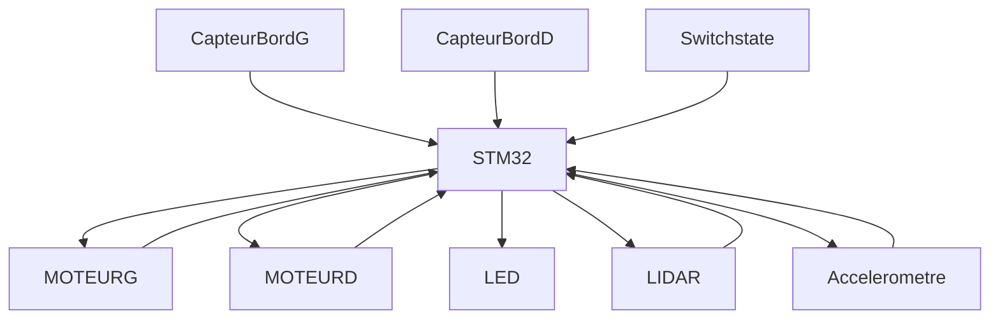

# !! LISTE A FAIRE !!
<details open>
<summary> <strong><ins>Schema:</ins></strong> </summary>
	
- [x] Regarder pour encodeurs 
- [x] Reprendre régulateur 5V (entrée à gauche et sortie à droite) 
- [x] VDDA pas alimenté 
- [x] Calculer valeur R pour les leds d'état 
- [x] supprimer label hiérarchique 7.2V 
- [x] Merge les feuilles pour moteur afin de modifier les deux à la fois 
- [x] faire symbole tof 
- [x] remplir valeur composants 
- [x] Renommer comme il faut pins de communication accélero 
- [x] Remplir le readme avec les schémas + calculs + présentation globale (ne pas avoir à aller chercher les fichiers à gauche à droite)
- [ ] Mettre texte descriptif pour définir connections
- [x] valeur R 2k3 plutôt que 2.3k  
- [x] valeur C 100n plutôt que 0.1µF  
- [x] Rendre l'ensemble plus clair (label et autre) 
</details>

<details >
<summary>  <strong><ins> PCB :</ins></strong> </summary>

- [x] PCB 54mm x 57mm
- [x] 4 trou de fixation a 4mm du bord Taille M3 
- [x] Remplacer l'empreinte de l'interrupteur pour le deporter hors du PCB 
- [x] condo proche 
- [x] reverifier empreinte condo imperial 
- [x] mettre port ldidar a coté de l'alimentation 5V
- [x] orientation serio j201 
- [x] en dernier les gpio pour le routage
- [x] router en premier les signaux rapides comme oscillateur, puis connecteur j201
- [x] plan de masse unique ideal
- [x] plan alim en 3,3V
- [x] changer empreinte grosse bobine 
- [x] 7.2V refaire connection (pas le meme tag) 
- [x] interrupteur a refaire empeinte plus petite 
- [x] refaire alim en suivant doc conseillé / 3 via 
- [x] Inverser pin driver moteur +zone de connexion plutot que piste 
- [x] rapprocher pastilles de ground et alim des vias associé 
- [x] aligner les composants 
- [x] Rapprocher la partie puissance (driver moteur) 
- [x] regarder plan pour retirer les antennes 
- [x] découplage 
- [x] plan sur grosse bobine 
- [x] agrandir piste gros courant 
  Routage :
- [x] Changement règle du CI -> diamètre mini via 0.45
		       -> diamètre mini anneaux 0.075
		       -> voir avec prof pour confirmer modifs (via copié depuis   correction fiack)
- [ ] TESTER LES CONNECTIONS
      
</details open> 

<details >
<summary> <strong> <ins> MECANIQUE: </ins></strong></summary>


- [ ] designer le parchoc qui porte les capteur de bord 
- [ ] designer les support ajustable
- [ ] imprimer les pieces du robot

</details>
<details >
<summary>  <strong><ins> SOFTWARE: </ins></strong></summary>


- [ ] piloter les driver moteurs
- [ ] piloter le lidar
- [ ] recevoir les donnés du lidar et les interpréter
- [ ] recevoir les donnés de l'accelerometre
- [ ] recevoir les donnés des capteurs de bords
- [ ] realiser les comportement en odometrie
- [ ] coder les comportement de fuite/evitement
- [ ] coder les comportement de chasse/collision
</details>

exemple graphe mermaid

```mermaid
  info
```

