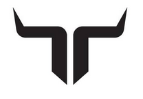

  

  

# 2425_ESE_Projet_Torero

## Projet de ESE de 3éme année de JACQUOT Nolan, GUIFFAULT Gabriel, BOULOT Paul et THOMAR Jean-Philippe

Ce projet contient toute les ressources de l'élaboration d'un robot capable de jouer au chat et a la souris.
Les liens vers les differentes ressources sont énuméré avec un court intitulé a la FIN du README.
Ci dessous le schéma architectural donnant les grandes lignes du projet.

  

[Schéma architectural](https://github.com/user-attachments/files/17220902/Schema.architectural.pdf)

## Cahier des charges:
> [!IMPORTANT]
>- Le robot doit etre capable de ce déplacer sur une table sans tomber (absence de bord et de marquage)
>- Le robot doit etre capable de detecter l'autre robot present sur la table pour le fuir ou le chasser en fonction de son role dans la partie.
>- Le robot doit etre capable de detecter un contact meme leger avec le robot adverse et changer son comportement d'un role vers l'autre.

Objectif annexe:
- Le robot peut realiser une odometrie simple pour suivre le bord de table lorsqu'il debute en souris
- Le robot peut realiser une odometrie simple pour se positionner au centre de la table avant de commencer la traque lorsqu'il debute en chat
- Le robot peut declencher un brusque changement de direction si il detecte un robot approchant rapidement en mode souris
- Le robot peut effectuer des prédiction de trajectoire et effectuer des trajectoires de collision en prévision du deplacement adverse en mode chat
- Le robot evite de prendre des directions ou il serait acculé dans un angle de table

## Environnement:

> [!IMPORTANT]
> Table de 200cm x 160cm
> 
> Table sans Bord ni marquages!
> 
> Robot assimilable a un cylindre de 17 cm de diametre et 15 cm de hauteur 

##  Liens utiles

### Documentation et ressources :
- [Datasheets](https://github.com/Manassehalt/2425_ESE_Projet_Torero/tree/main/Datasheet)  
- [Liste des tâches](https://github.com/Manassehalt/2425_ESE_Projet_Torero/blob/main/Calculs%20et%20brouillons/Remarque_Sch.md)  
- [BOM (Bill of Materials)](https://github.com/Manassehalt/2425_ESE_Projet_Torero/blob/main/BOM.xlsx)  
- [PCB Info](https://github.com/Manassehalt/2425_ESE_Projet_Torero/blob/main/PCB/info_PCB.docx)  

### Design électronique :
- [Fichiers PCB](https://github.com/Manassehalt/2425_ESE_Projet_Torero/tree/main/PCB)  
- [Schémas KiCad](https://github.com/Manassehalt/2425_ESE_Projet_Torero/blob/main/PCB/Projet_torero/Projet_torero.kicad_sch)  

### Code STM32 :
- [Dossier code](https://github.com/Manassehalt/2425_ESE_Projet_Torero/tree/main/Projet_ESE_STM32)  

---

### Apercu serigraphie :

  

[view PCB 3D](https://github.com/Manassehalt/2425_ESE_Projet_Torero/blob/main/Graphique_Logo/PCB%20carte%203d.PNG)

### Methode si nouvel ordinateur : 
> [!TIP]
>Générer une clé SSH
>- Taper ssh-keygen puis Entrer
>- Appuyer sur y pour overwrite et sur Entrer pour passer les étapes (if no passphrase)
>- Taper cat ~/.ssh/id_ed25519.pub puis Entrer
>- Copier puis coller la clé dans GitHub Setting > SSH and GPG keys > SSH keys
>- Renommer avec le nom du PC pour savoir à quoi la clé correpond
>  ex : jeanp@HP-Pavilion-JP

### Ligne pour cloner un répertoire en utilisant le port 443 (https) au lieu du port 22, si bug sur la connexion:
> [!TIP]
>git clone ssh://git@ssh.github.com:443/username/Repositority_name.git
